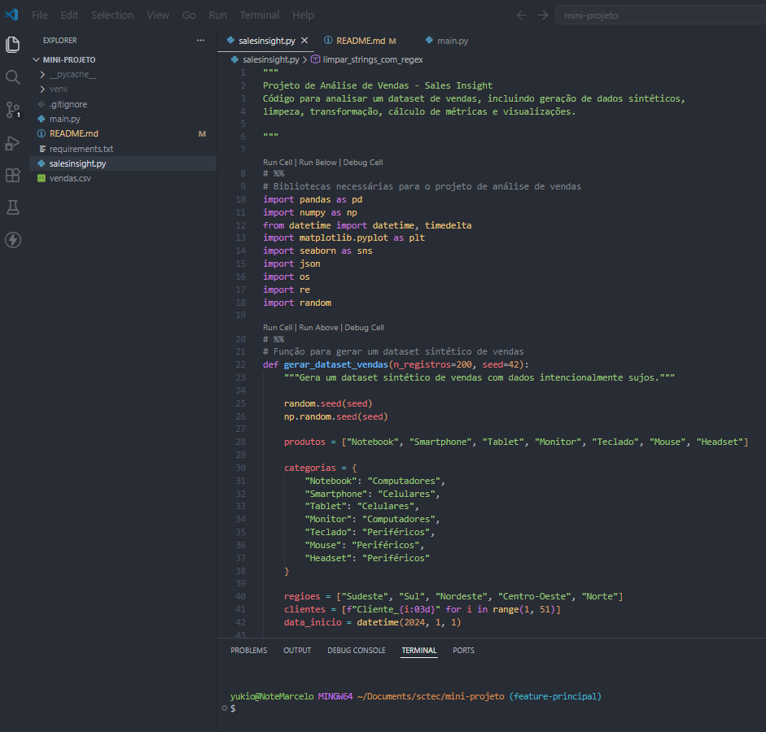

# SalesInsight PY: Pipeline de Análise e Visualização de Dados de Vendas 💰

## Sobre o Projeto 🚀

O SalesInsight PY é um pipeline completo de análise de dados de vendas desenvolvido em Python.

O sistema realiza:
- Geração de dataset sintético
- Limpeza e tratamento de dados
- Transformações e colunas derivadas
- Cálculo de métricas agregadas
- Estatísticas com NumPy
- Visualizações com Matplotlib e Seaborn
- Organização do pipeline usando Programação Orientada a Objetos
- Projeção simples de tendência

O sistema analisa:  
- Receita total e volume de vendas por mês e trimestre
- Top produtos e categorias por receita
- Desempenho por região
- Segmentação de clientes por nível de gasto (Bronze, Prata, Ouro)
- Projeção simples de tendência para os próximos meses
- Exportação de relatórios em CSV e JSON  

---

## Objetivo Educacional 🎯

Este projeto foi desenvolvido para praticar os conceitos do módulo 01 de IA para Análise Preditiva, simulando um pipeline real de análise de vendas em aula.  
Tópicos abordados:
- Lógica de programação com Python
- Variáveis, tipos de dados e operadores
- Condicionais (if, elif, else) e repetição (for, while)
- Funções, parâmetros, retorno e funções lambda
- Funções de ordem superior (função que recebe função)
- Leitura e escrita de arquivos CSV e JSON
- Módulo datetime para manipulação de datas
- Expressões regulares com o módulo re
- Pandas: DataFrames, limpeza, groupby, filtros e transformações
- NumPy: arrays, operações vetorizadas, broadcasting, np.select
- Matplotlib e Seaborn: gráficos, customização e exportação em PNG
- Classes, construtores, atributos, métodos, herança e super()
- GitHub, branches, commits e GitFlow simplificado
- Kanban para organização do projeto

---

## Tecnologias Utilizadas 💻

- Python 3.11.9
- Pandas
- NumPy
- Matplotlib
- Seaborn
- Jupyter Notebook
- VS Code 
- GitHub para versionamento
- Trello para Kanban

---

## Estrutura do Projeto 🗂️

```bash
salesinsight-py/
│
├── salesinsight.py
├── main.py
├── vendas.csv
├── outputs/
│       ├── graficos
│       ├── estatisticas_gerais.json
│       ├── metricas_por_mes.csv
│       ├── relatorio_resumo.csv
│       └── segmentacao_clientes.csv
│
└── README.md
```
---

## Como Executar ▶️

### Localmente com VS Code 

```bash
1. Instale o Python 3.10+ e o VS Code.
2. Crie uma pasta e um ambiente virtual
```

Abra o terminal:

```bash
3. Clone todos os arquivos deste projeto na pasta criada:
- salesinsight.py
- main.py 
- requirements.txt

4. Instale as dependências: 
pip install - r requirements.txt

5. Execute no terminal: python main.py
```

## Conceitos Aplicados ✅

- Pandas DataFrame
- NumPy Arrays
- GroupBy
- Funções Lambda
- Funções de Ordem Superior
- Expressões Regulares
- Programação Orientada a Objetos
- Exportação CSV e JSON
- Visualização de Dados

---

## Como a internet funciona (contexto do projeto) 🛜
Neste projeto, os dados são lidos de um arquivo local CSV. Em um cenário real de
produção, esses dados poderiam vir de uma API REST (ex.: uma requisição HTTP GET
para um servidor que retorna JSON). O cliente (seu script Python) faria a requisição,
o servidor processaria e retornaria os dados — seguindo a arquitetura cliente-servidor.
Bibliotecas como `requests` permitem consumir essas APIs diretamente no Python.

---
## Vídeo de demonstração 🎬
<p align="center">
    <a href="https://drive.google.com/file/d/1GJ1XL6eydNtQfoSm7rNdMsCzVNWijxKd/view?usp=drive_link">
        
    </a>
    <br>
    <em>Clique na imagem para assistir à apresentação do projeto.</em>
</p>
---

## 🤓 Colaboradores: 
Auxiliadora Silvino Arce  
Franciane Schier Leite  
Marcelo Yukio Takahashi